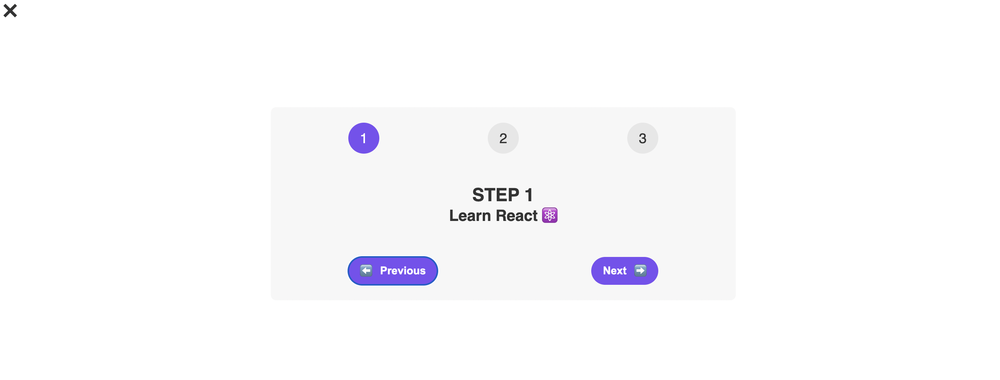
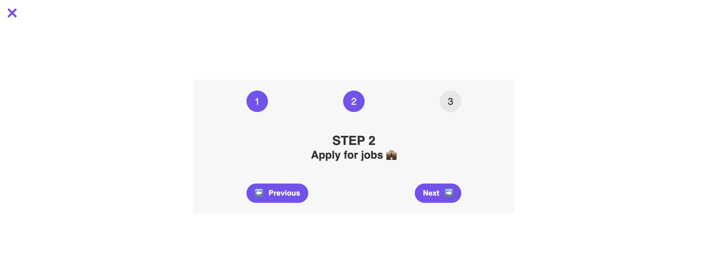

# Simple Step React App

This is a simple React application that provides a step-by-step guide for a user's journey. The user can navigate between the different steps, view messages, and see their current position.

## Features:

1. **Multiple Step Indicators**: Clearly indicates which step the user is on with a numeric indicator.
2. **Dynamic Step Messages**: Displays messages that are associated with each step.
3. **Navigation**: Allows user to navigate to the previous or next step with the help of buttons.
4. **Toggle Feature**: User can toggle the visibility of the step guide with a close button.
5. **Styling**: Customizable button color and text color using inline styles.

## Components:

- `App`: The root component which renders the main layout.
- `Steps`: Renders the entire step-by-step guide. It also manages the state of the current step and the visibility of the guide.
- `StepMessage`: Displays the message for the current step.
- `Button`: A reusable button component with customizable styles.

## Main Learning Points:

1. **React State Management**: Using the `useState` hook to manage component state and create interactive UIs.
2. **Component Composition**: Building and integrating multiple components to create a larger, cohesive application.
3. **Props Passing**: Sending data between parent and child components using props.
4. **Event Handling**: Creating and managing user interactions such as button clicks.
5. **Conditional Rendering**: Displaying content conditionally based on component state.
6. **Inline Styling**: Applying styles to components using inline style props.

## How to Run:

1. Clone the repository.
2. Navigate to the project directory and run `npm install`.
3. Once dependencies are installed, run `npm start`.
4. Open a browser and go to `http://localhost:3000`.

